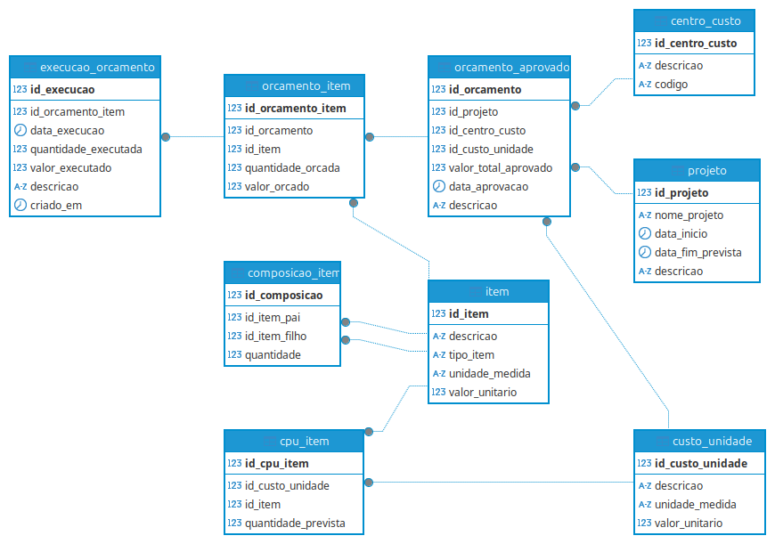

# Sistema de Gerenciamento de Obras Civis

## Visão Geral

Este projeto é um sistema de gerenciamento de obras civis desenvolvido para planejar, orçar e controlar a execução de projetos de construção, como edifícios residenciais ou comerciais. Utiliza um banco de dados relacional (PostgreSQL) para organizar informações sobre projetos, centros de custo, custos unitários, itens, orçamentos aprovados e execução física, com foco na Estrutura Analítica do Projeto (EAP) e na composição detalhada de custos.

O sistema foi modelado em SQL, convertido para o ORM Prisma e exemplificado em JSON para demonstrar sua aplicação prática. O objetivo é permitir o acompanhamento do orçamento aprovado e da execução real, detalhando custos por unidade (CPU) e a composição de itens, como materiais, serviços e equipamentos.

## Estrutura do Banco de Dados

O sistema é composto por 9 tabelas inter-relacionadas, cada uma com um propósito específico.

[EAP.sql](./DB/EAP.sql)

### Tabelas e Relacionamentos

- **`projeto`**
  - **Descrição**: Representa a obra ou empreendimento (ex.: "Construção de Edifício Residencial").
  - **Campos**: `id_projeto` (PK), `nome_projeto`, `data_inicio`, `data_fim_prevista`, `descricao`.
  - **Relacionamentos**: Pai de `orcamento_aprovado` (1:N).

- **`centro_custo`**
  - **Descrição**: Define áreas ou etapas da obra para alocação de custos (ex.: "Fundação").
  - **Campos**: `id_centro_custo` (PK), `descricao`, `codigo` (único).
  - **Relacionamentos**: Vinculado a `orcamento_aprovado` (1:N).

- **`custo_unidade`**
  - **Descrição**: Armazena custos unitários (CPU) de atividades ou insumos (ex.: "Concreto Armado" a R$ 500/m³).
  - **Campos**: `id_custo_unidade` (PK), `codigo`, `descricao`, `unidade_medida`, `valor_total`.
  - **Relacionamentos**: Vinculado a `orcamento_aprovado` (1:N) e `cpu_item` (1:N).

- **`orcamento_aprovado`**
  - **Descrição**: Registra o orçamento total aprovado para um projeto, associado a um centro de custo e um custo unitário.
  - **Campos**: `id_orcamento` (PK), `id_projeto` (FK), `id_centro_custo` (FK), `id_custo_unidade` (FK), `valor_total_aprovado`, `data_aprovacao`, `descricao`.
  - **Relacionamentos**: Filho de `projeto`, `centro_custo` e `custo_unidade`; pai de `orcamento_item` (1:N).

- **`item`**
  - **Descrição**: Lista os itens da obra (materiais, serviços, equipamentos), como "Concreto Armado" ou "Cimento".
  - **Campos**: `id_item` (PK), `descricao`, `tipo_item` (Material, Serviço, Equipamento, Terceirizado), `unidade_medida`, `valor_unitario`.
  - **Relacionamentos**: Relaciona-se consigo mesmo via `composicao_item` (pai e filho); vinculado a `cpu_item` e `orcamento_item` (1:N).

- **`composicao_item`**
  - **Descrição**: Define a composição hierárquica de itens (ex.: "Concreto Armado" composto por "Cimento" e "Areia").
  - **Campos**: `id_composicao` (PK), `id_item_pai` (FK), `id_item_filho` (FK), `quantidade`.
  - **Relacionamentos**: Duas chaves estrangeiras para `item` (pai e filho).

- **`cpu_item`**
  - **Descrição**: Detalha os itens associados a um custo unitário, com quantidades previstas (ex.: 300 m³ de concreto).
  - **Campos**: `id_cpu_item` (PK), `id_custo_unidade` (FK), `id_item` (FK), `quantidade_prevista`.
  - **Relacionamentos**: Filho de `custo_unidade` e `item`.

- **`orcamento_item`**
  - **Descrição**: Especifica os itens orçados, com quantidades e valores (ex.: 300 m³ de concreto por R$ 150.000,00).
  - **Campos**: `id_orcamento_item` (PK), `id_orcamento` (FK), `id_item` (FK), `quantidade_orcada`, `valor_orcado`.
  - **Relacionamentos**: Filho de `orcamento_aprovado` e `item`; pai de `execucao_orcamento` (1:N).

- **`execucao_orcamento`**
  - **Descrição**: Registra a execução real do orçamento (ex.: 100 m³ por R$ 50.000,00).
  - **Campos**: `id_execucao` (PK), `id_orcamento_item` (FK), `data_execucao`, `quantidade_executada`, `valor_executado`, `descricao`, `criado_em`.
  - **Relacionamentos**: Filho de `orcamento_item`.

### Dados em JSON
[EAP.json](./DB/EAP.json)

### Modelagem Prisma
[EAP.prisma](./DB/EAP.prisma)
